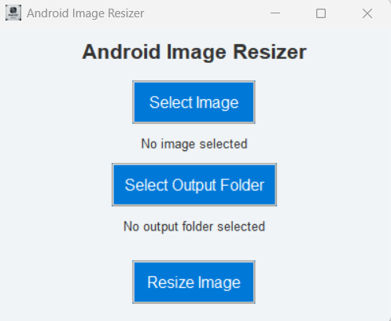

# 🎨 Android Image Resizer

A simple and modern **Android Image Resizer** built with **Python** and **Tkinter**. This lightweight application allows developers to resize images to predefined Android development sizes with a user-friendly interface.

**Android Image Resizer** streamlines the process of creating images for various Android screen densities, ensuring that developers can focus on building great apps without worrying about manual image resizing.

---

## 🔍 Key Features of the App

- **Predefined Android Sizes**  
  Resize images to popular Android screen densities, including `xxxhdpi`, `xxhdpi`, `xhdpi`, `hdpi`, and `mdpi`.

- **Support for Multiple Formats**  
  Accepts various image formats such as PNG, JPG, BMP, and WebP, and retains the input format for output files.

- **User-Friendly GUI**  
  Built using **Tkinter**, the app provides a clean and intuitive interface for seamless resizing.

- **Customizable Output Directory**  
  Save resized images in a specified output folder with proper naming conventions.

- **Open-Source Project**  
  Fully transparent and open for contributions under the **MIT** license.

---

## 🚀 **Usage**

To run the application:

### Windows Executable
Please use this link to download [Setup](https://github.com/manxlr/AndroidImageResizer/releases/download/v1.0.0/AndroidImageResizer.exe).

### Source Code

1. Clone or download the repository.
2. Run the application using:
   ```bash
   python AndroidImageResizer.py
   ```
3. A GUI window will open, allowing you to select an image, choose the output directory, and resize the image to Android-specific sizes.



4. Results
  - Original Image

  - mdpi

  - hdpi

 -  xhdpi

 -  xxhdpi

 -  xxxhdpi

---

## 🛠️ **Features**

- **Android-Specific Resizing**: Resize images to sizes like `192x192`, `144x144`, and more.
- **Multi-Format Support**: Input and output support for common formats like PNG, JPG, and WebP.
- **Modern GUI**: Features a sleek, user-friendly design with dynamic buttons and a custom application icon.

---

## 🤝 **Contribution**

We welcome contributions! If you have any improvements, bug fixes, or new ideas, feel free to contribute to the repository:

- Fork the repository.
- Create a new branch.
- Submit a **Pull Request** with a detailed description of your changes.

### Repo Link: [https://github.com/manxlr/androidimageresizer](https://github.com/manxlr/androidimageresizer)

---

## 📜 **License**

This project is licensed under the **MIT License**, allowing you to freely use, modify, and distribute the code.

[MIT License](https://opensource.org/licenses/MIT)

---

## 📧 **Contact**

For any questions, suggestions, or feedback, please reach out:

- **Email**: [nszeeshankhalid@gmail.com](mailto:nszeeshankhalid@gmail.com)  
- **GitHub**: [https://github.com/manxlr](https://github.com/manxlr)

---

### 🔗 **Links**

- [GitHub Repository](https://github.com/manxlr/androidimageresizer)

---

## 💖 **Donations**

If you find this project helpful and would like to support its continued development, you can donate using the following cryptocurrency addresses:

- **Ethereum (ETH)**: `0x23774348bc491Ff70F39c63f39B0e542a59b5B14`  
- **Bitcoin (BTC)**: `bc1qp7wltg8frvecuujjs9f3ck28r0s0h0qzld2fu6`  
- **Dogecoin (DOGE)**: `DTbwxMs4wenN2kUea77rHPQ8nbJrSk4o7D`  

Your support is greatly appreciated and helps maintain and improve open-source projects!

---

